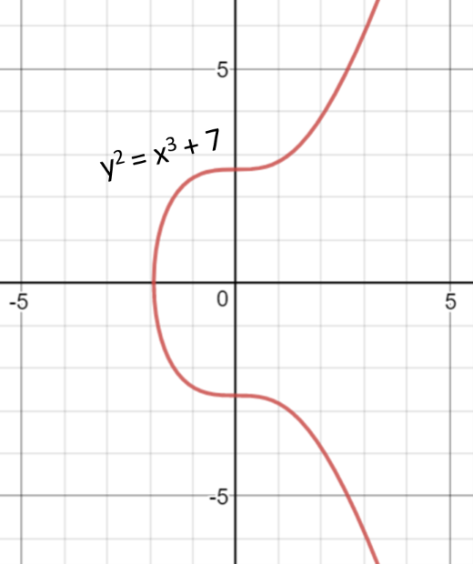

Bitcoin's security relies on **elliptic curve cryptography (ECC)**, specifically the **secp256k1** curve. This article explores how it works, why Bitcoin chose it, and how to implement it in Rust.

### What Is secp256k1?

The **secp256k1** curve is the elliptic curve used by Bitcoin for generating private keys, public keys, and digital signatures. Its name encodes several technical properties:

- **"sec"** stands for *Standards for Efficient Cryptography*
- **"p"** indicates a *prime field* (operations modulo a large prime number)
- **"256"** represents the key size: 256 bits
- **"k"** indicates a *Koblitz curve* (optimized, simple, patent-free)
- **"1"** means it's the first curve of this category

Bitcoin uses secp256k1 because it's transparent, extremely fast, and secure, based on the *discrete logarithm problem*. Its defining equation is remarkably simple:

```
y² ≡ x³ + 7 (mod p)
```

This simplicity reduces attack surfaces and makes implementations easier to audit.

### The Elliptic Curve Equation

Bitcoin's curve uses the Weierstrass form with coefficients:

- `a = 0`
- `b = 7`

This defines a set of points `(x, y)` that satisfy the equation over a finite field. The simplicity is deliberate—no hidden parameters, maximum transparency.



### Point Addition on Elliptic Curves

Elliptic curve cryptography relies on point addition. The geometric intuition:

1. Draw a line through two points `P` and `Q` on the curve
2. The line intersects the curve at a third point `R`
3. Reflect `R` vertically to get `P + Q`

This operation is commutative, associative, and computationally efficient—but reversing it is extremely hard.

### Scalar Multiplication: The Core Operation

Scalar multiplication is the foundation of ECC security:

```
P = k × G
```

Where:
- `k` = private key (256-bit random number)
- `G` = generator point (fixed point on the curve)
- `P` = resulting public key

This is essentially repeated point addition: `G + G + G + ... (k times)`.

**The magic:** Computing `P` from `k` and `G` is trivial. But given `P` and `G`, finding `k` is computationally infeasible. This asymmetry protects private keys.

## From Private Key to Bitcoin Address

The derivation process:

1. **Private key**: Random 256-bit number
2. **Public key**: `P = k × G` (scalar multiplication)
3. **Bitcoin address**: Hash and encode the public key

This layered approach provides defense in depth—even if a public key is exposed on-chain, the private key remains secure.

### Practical Rust Implementation

#### Setup and Dependencies

First, add the required dependencies to your `Cargo.toml`:

```toml
[dependencies]
secp256k1 = "0.29"
rand = "0.8"
sha2 = "0.10"
```

#### Initialize secp256k1 Context

```rust
use secp256k1::{Message, PublicKey, Secp256k1, SecretKey};
use rand::{rng, RngCore};
use sha2::{Sha256, Digest};

fn main() {
    // Create the secp256k1 context for all cryptographic operations
    let secp = Secp256k1::new();
    
    // Initialize the random number generator
    let mut rng = rng();
}
```

#### Generate Private and Public Keys

```rust
    // Generate a random 256-bit (32 bytes) private key
    let mut secret_bytes = [0u8; 32];
    rng.fill_bytes(&mut secret_bytes);
    let private_key = SecretKey::from_byte_array(secret_bytes)
        .expect("Invalid secret key");

    // Derive the corresponding public key via scalar multiplication (P = k × G)
    let public_key = PublicKey::from_secret_key(&secp, &private_key);
    
    println!("Private key generated: {} bytes", secret_bytes.len());
    println!("Public key: {:?}", public_key);
```

#### Sign a Message with ECDSA

```rust
    // Message to sign
    let message = b"Hello, world!";
    
    // Calculate the SHA-256 hash of the message
    let hash = Sha256::digest(message);
    
    // Convert the hash to a 32-byte array for secp256k1
    let mut hash_arr = [0u8; 32];
    hash_arr.copy_from_slice(&hash);
    let msg = Message::from_digest(hash_arr);

    // Sign the message with the private key (ECDSA)
    let signature = secp.sign_ecdsa(&msg, &private_key);
    println!("Signature: {:?}", signature);
```

#### Verify the Signature

```rust
    // Verify the signature with the public key
    let valid = secp.verify_ecdsa(&msg, &signature, &public_key);
    println!("Signature valid: {}", valid.is_ok());
```

#### Complete Working Example

Here's the full implementation showing key generation, signing, and verification:

```rust
use secp256k1::{Message, PublicKey, Secp256k1, SecretKey};
use rand::{rng, RngCore};
use sha2::{Sha256, Digest};

fn main() {
    // Initialize the secp256k1 context
    let secp = Secp256k1::new();
    let mut rng = rng();

    // Generate a random private key
    let mut secret_bytes = [0u8; 32];
    rng.fill_bytes(&mut secret_bytes);
    let private_key = SecretKey::from_byte_array(secret_bytes)
        .expect("Invalid secret key");

    // Derive the public key
    let public_key = PublicKey::from_secret_key(&secp, &private_key);

    // Prepare and sign a message
    let message = b"Hello, world!";
    let hash = Sha256::digest(message);
    let mut hash_arr = [0u8; 32];
    hash_arr.copy_from_slice(&hash);
    let msg = Message::from_digest(hash_arr);

    let signature = secp.sign_ecdsa(msg, &private_key);
    println!("Signature: {:?}", signature);

    // Verify the signature
    let valid = secp.verify_ecdsa(msg, &signature, &public_key);
    println!("Signature valid: {}", valid.is_ok());
}
```

### Conclusion

Bitcoin's security isn't magic—it's elegant mathematics combined with efficient cryptography. The secp256k1 curve provides the perfect balance of simplicity, transparency, and security.

With just a few lines of Rust, you can reproduce the same cryptographic operations that secure billions of dollars in Bitcoin transactions every day. Understanding these fundamentals is essential for anyone building on Bitcoin or exploring blockchain technology.

**Code, Peace and Love**